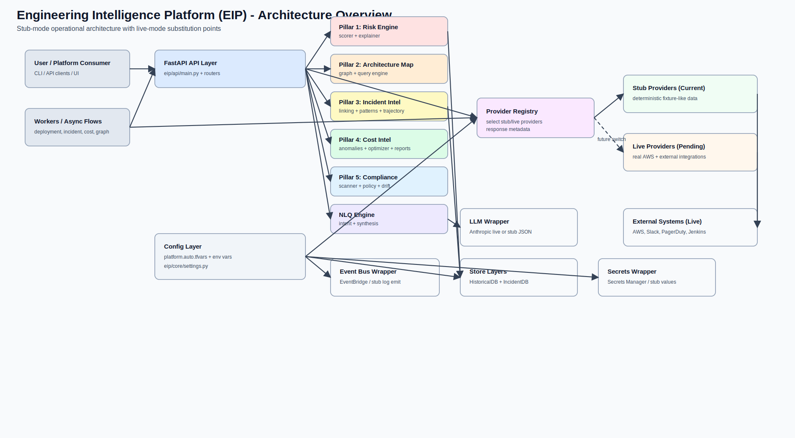
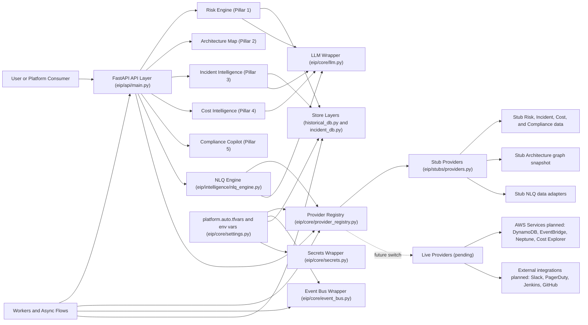
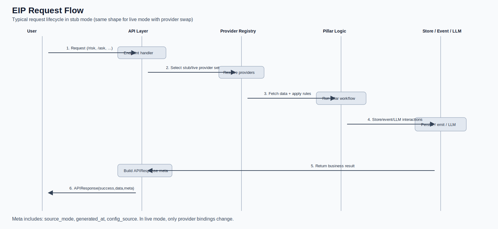
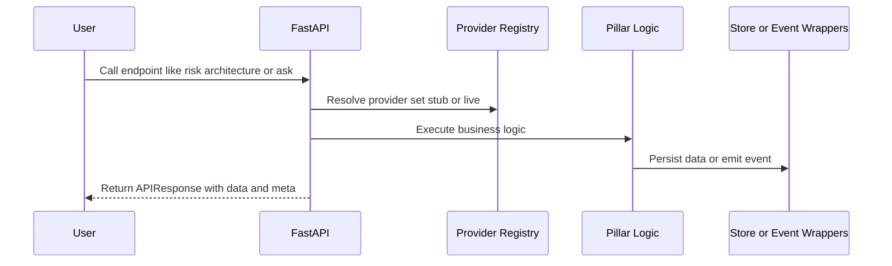

# EIP Product Architecture

This diagram shows the current stub-mode product architecture and the live-mode substitution points.

## Static Diagram (SVG)

```mermaid
flowchart LR
  U["User or Platform Consumer"] --> A["FastAPI API Layer (eip/api/main.py)"]
  C["Workers and Async Flows"] --> A
  A --> R["Risk Engine (Pillar 1)"]
  A --> M["Architecture Map (Pillar 2)"]
  A --> I["Incident Intelligence (Pillar 3)"]
  A --> K["Cost Intelligence (Pillar 4)"]
  A --> S["Compliance Copilot (Pillar 5)"]
  A --> N["NLQ Engine (eip/intelligence/nlq_engine.py)"]

  N --> PR["Provider Registry (eip/core/provider_registry.py)"]
  A --> PR
  C --> PR

  PR --> ST["Stub Providers (eip/stubs/providers.py)"]
  PR -.->|future switch| LV["Live Providers (pending)"]

  CFG["platform.auto.tfvars and env vars (eip/core/settings.py)"] --> PR
  CFG --> EB["Event Bus Wrapper (eip/core/event_bus.py)"]
  CFG --> DB["Store Layers (historical_db.py and incident_db.py)"]
  CFG --> SEC["Secrets Wrapper (eip/core/secrets.py)"]

  C --> EB
  C --> DB
  R --> DB
  I --> DB
  R --> LLM["LLM Wrapper (eip/core/llm.py)"]
  I --> LLM
  K --> LLM
  N --> LLM

  ST --> D1["Stub Risk, Incident, Cost, and Compliance data"]
  ST --> D2["Stub Architecture graph snapshot"]
  ST --> D3["Stub NLQ data adapters"]

  LV --> AWS["AWS Services planned: DynamoDB, EventBridge, Neptune, Cost Explorer"]
  LV --> EXT["External integrations planned: Slack, PagerDuty, Jenkins, GitHub"]
```

## Request/Flow View

```mermaid
sequenceDiagram
  participant User as User
  participant API as FastAPI
  participant Registry as Provider Registry
  participant Pillar as Pillar Logic
  participant Store as Store or Event Wrappers

  User->>API: Call endpoint like risk architecture or ask
  API->>Registry: Resolve provider set stub or live
  API->>Pillar: Execute business logic
  Pillar->>Store: Persist data or emit event
  API-->>User: Return APIResponse with data and meta
```
